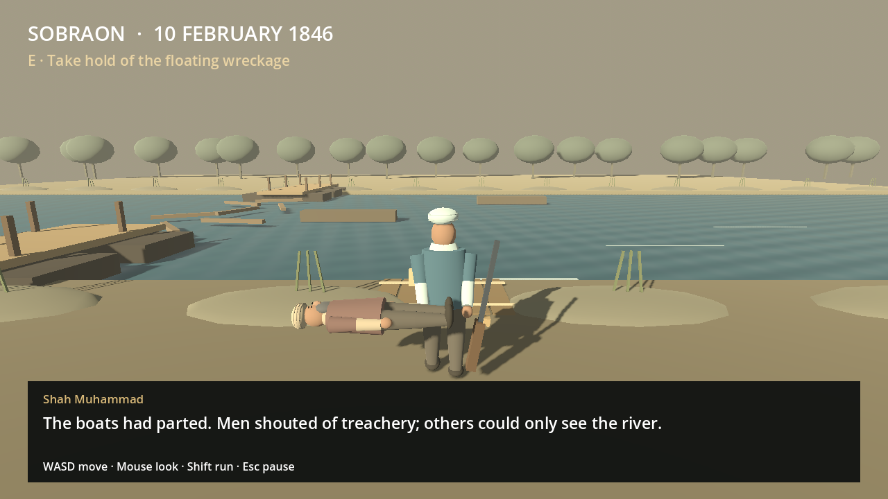
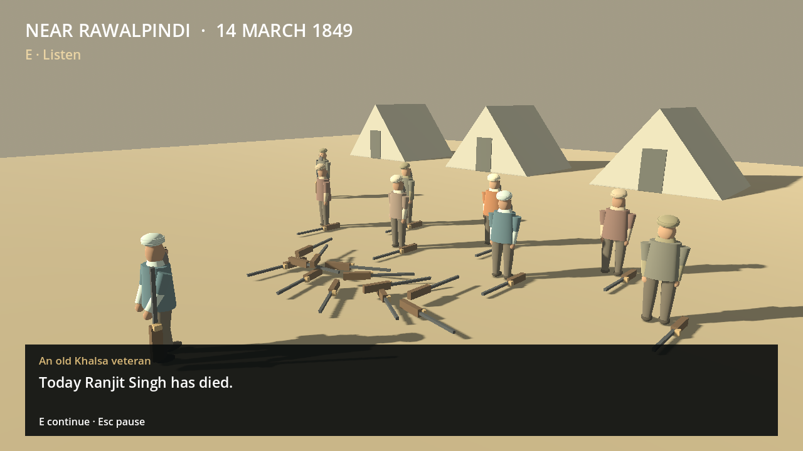
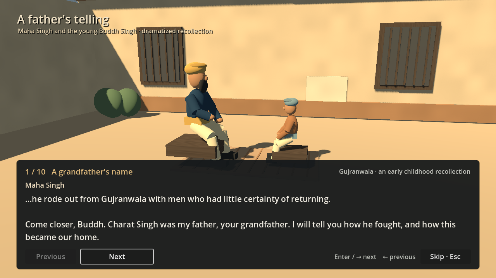

# Sobraon and the two tellings

The production **Begin** action now opens a playable later-life frame around the
existing Charat Singh family introduction. The same retained Home remains parked
through the entire visit. The established childhood journey resumes afterward.

These are unretouched native prototype captures from the action-driven route.
The model and environment art remain early staging.





## Playable sequence

1. **Sobraon, 10 February 1846.** An unnamed Sikh veteran starts after the pontoon
   bridge has broken. Walk through the earthworks, avoid telegraphed impacts and
   reach the riverbank. Helping the nearby wounded comrade is optional and slows
   the existing player motor. It provides no childhood reward or moral score.
2. **The Sutlej.** E boards floating timber at the bank. W/S and A/D move and steer
   the wreckage against a slight authored lateral current. Collidable timbers
   obstruct the route. The river has no invisible walking floor; entering it on
   foot produces a retry. Reaching the far bank completes the escape.
3. **Near Rawalpindi, 14 March 1849.** E follows the telling across an explicit date
   change. The same survivor, with the same sleeve repair, approaches the waiting
   soldiers. Seven soldiers lower and drop their muskets in sequence. Metal
   impacts replace the river sound. An old veteran speaks the reported lament,
   “Today Ranjit Singh has died.”
4. **Shah Muhammad's telling.** The narration moves through Ranjit, his father
   Maha Singh, and his grandfather Charat Singh. Shah introduces a father's words:
   “Maha Singh told his son: ‘Before these courtyards were familiar to you…’”
5. **Maha Singh's telling.** A short fade enters the existing family scene. Maha
   completes the sentence: “…he rode out from Gujranwala with men who had little
   certainty of returning.” The original ten campaign/family pages then continue.
   This links two oral tellings of Charat Singh without giving the child future
   knowledge. The existing playable childhood and training follow.

## Controls and lifecycle

- WASD: walk; mouse: look; Shift: run where allowed; E: nearby interaction or
  continue an available narrative beat.
- On the wreckage: W/S fore/aft, A/D steer. Camera direction does not change the
  raft's axes. The current and speeds are authored gameplay parameters.
- Esc: pause/resume. R retries a failed escape. Retry uses the reached riverbank
  checkpoint, or the opening position before that checkpoint, retaining any
  rescue already earned in this visit. It writes no persistent save.
- F2, or the pause-menu button: explicitly skip to the family story. This is
  recorded as a skip and does not claim a completed escape or the earned shared
  sentence. The family's existing Skip remains available afterward.

`home_launch.gd` defaults to the full sequence. `make_world()` remains inert;
`enter(tree, false)` supports the existing family-specific qualification. The
original beginning/childhood render routes launch normally and explicitly press
F2 before qualifying the family and childhood; they do not claim to play Sobraon.

`childhood_intro_session.gd` extends its existing isolated SubViewport lifecycle.
The shared player motor controls the veteran on land. Only aboard the timber does
the local kinematic raft transport the same body. Home's existing player, physics,
clock, canvases and audio stay parked. At the family handoff and final return, the
session verifies the original state SHA. No prologue observation is admitted to
the campaign model, journal, inventory, capabilities, memory, save or checkpoint.

## Historical and dramatic identities

See `data/history/sobraon_opening_sources.json` for the separate evidence and
authoring records. Sobraon and the later surrender are never collapsed into one
date. Bridge destruction is observed; responsibility remains unresolved. The
veteran, optional rescue, local route, sleeve motif, gestures and linking dialogue
are original dramatic construction. The reported lament belongs to a veteran;
new connecting lines are not labelled as quotations from Shah Muhammad's poem.
The use of Shah Muhammad as a retrospective narrator is a dramatic frame, not a
claim that he accompanied this soldier or recited these exact words in 1849.

This is a bounded playable staging, not a surveyed 1:1 Sobraon reconstruction or
a full Anglo-Sikh war campaign. Its presence does not move DLC production ahead
of Ranjit Singh's full narrative. The figures and equipment reuse original
procedural art. Final battle art, period-uniform qualification, water simulation,
crowd combat, recorded Punjabi narration and performance direction remain future
production work. Current delivery is captioned narration plus original generated
river, cannon and metal sounds, not a voiced cinematic.

## Qualification

`test_sobraon_prologue.gd` launches through production Home entry, drives movement
actions and routed keyboard events through rescue, a genuine unsupported-river
failure, retry, steered crossing, surrender and the voice handoff. It tests paused
local time, proximity gates, exact Home preservation, no save writes, distinct
skip/completion records, restored input and teardown. Route positions are targets,
not injected poses; no progress is seeded. It is code-driven native engine input,
not OS-level automation or a human playtest.

Run with pinned Godot 4.5.1:

```sh
godot --headless --fixed-fps 60 --path game --script res://tests/test_sobraon_prologue.gd
godot --fixed-fps 60 --path game --rendering-method gl_compatibility --audio-driver Dummy --script res://tests/test_sobraon_prologue.gd -- --capture
```

The second command requires a real display and retains production-camera PNGs
and a manifest under `user://sobraon-opening-images`. Captures and failed attempts
are labelled separately from historical evidence. Existing family-session and
childhood suites remain part of the regression check.
